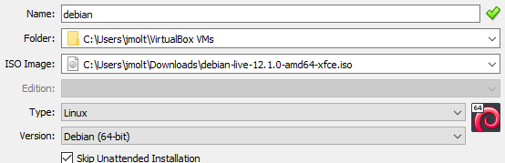
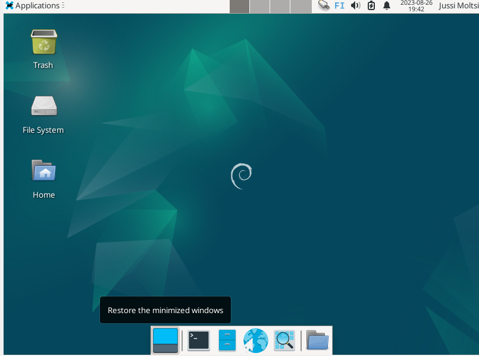
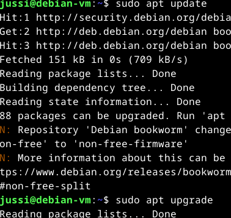

# H1 Raportti
Raportin tulee olla selkeä ja sitä ei saa kirjoittaa mistään mitä et ole itse tehnyt.  
Raportissa olisi hyvä olla täsmällinen kertomuksessaan.  
Helppolukuisuus ja lähteiden käyttö olisi suotavaa  

## Mikä on vapaa ohjelmisto
                     Ohjelmoijat selvästi olleet luomassa sääntöjä, kun numeroitu 0–3.
-	Sitä voi käyttää täysin vapaasti kaikkeen mihin haluat sitä käyttää.
-	Opiskella sen käyttöä ja muokata sitä tekemään haluamiasi asioita.
-	Saat jakaa sitä vapaasti eteenpäin.
-	Saat jakaa itse muokkaamaasi versiota ja auttaa muita versiollasi.

Vapaalla ohjelmistolla saa tehdä rahaa, mutta sen pitää säilyttää edellä mainitut vapaudet. Ohjelmaan ei saa lisätä rajoitteita, jotka vaikuttavat muiden mahdollisuuksiin käyttää ja muokata ohjelmistoa.
Jatkokehitettyjen versioiden jakamisessa täytyy pitää kunnioittaa edellisten versioiden tekijöitä ja muokata mahdollisia logoja yms. Vapaiden ohjelmistojen kanssa voi myös ilmetä tekijänoikeuskiistoja, joskin hyvin harvoin.

## Linux asennus

Virtualbox ladattuna ja asennettuna. 

Virtuaalikoneen luontiin käytetään debian-live-12.1.0-amd64-xfce versiota.
Asennan virtuaalikoneen kotikoneelle seuraavilla spekseillä.  
OS: Windows 10 Home 64-bit 
CPU: AMD Ryzen 5 5600X 6-Core 
RAM: 16GB DDR4 
Kovalevytilaa riittävästi 

Virtuaalikoneelle 4 gigatavua keskusmuistia ja 20 gigatavua kovalevytilaa dynaamisena. 

Virtuaaliprosessoreita laitoin 4 käyttöön.  

Virtual boxista debian koneen kohdalta painetaan Start.
Heti virhe. Sama mikä tunnilla oli joillain henkilöillä. 
Power up failed (vrc=VERR_SVM_DISABLED, hrc=E_FAIL (0X80004005)) 
Biossista prosessorin virtualisointi käyttöön ja homma rullaa normaalisti. 
Kuvien saaminen biossista erittäin ison työn takana. Mikäli kohtaat saman ongelman kannattaa Googlata omalla bios/uefi versiolla ohjeet ongelman korjaamiseen.  
Kieli Englanti. 
Näppis Suomi. 
Verkkoasetuksista:  
Hostname debian  
Domain name: Jätän tyhjäksi koska yksityinen tietokone.  
Luon itselleni käyttäjän ja juuritason salasanan.  
Kovalevyn jakamista (partition) ei lähdetä tekemään niin valitaan "All files in one partition".  
Kirjoitetaan muutokset kovalevylle "write the changes to disks?" Yes  
### Network mirror  
Ota ehdottomasti käyttöön. Tämän avulla asennetaan ohjelmistoja Terminalilla.  
Valitsen mirror maaksi suomen ja mirror hakemistoksi deb.debian.org  
Proxy jää tyhjäksi.  
Mikäli saat virhetekstin "Bad archive mirror" -> Tarkasta asennuksen aikana määrittämäsi internet-asetukset.  
Jos jätät network mirrorin tekemättä. Voit asentaa vain hyvin minimaalisen määrän ohjelmistoja ja vain niitä jotka sisältyvät asennustiedostoon.  
### GRUB boot loader
Asennetaan kiintolevylle (yes/no) valitaan Yes  
Valitaan (ata-VBOX_HARDDISK) virtuaalikiintolevy  
/Finishing the installation/  
Reboot aika ja pitkä lista [ok] kohtia. 
Sisäänkirjautuminen. 
Työpöytä ilmestyy. Lets go. 

Asennukseen kului aikaa noin 30min.
## Bonus tehtävä
Avaan terminalin ja ajan sudo apt update komennon  
kirjoitan root passwordin  
Nyt meillä on juuritason oikeudet käytössä järjestelmän käyttöön. 
Mitä komento teki? Se haki meille uusimmat paketit, joita voidaan käyttää sovelluksien asennuksessa.
Päivitetään paketit. sudo apt upgrade.  
Terminaali kysyy varmistuksen [y/n] kirjoitetaan y ja enter.  
Linux asentaa ohjelmistopaketit ja terminaali pysähtyy. 

## Lähteet
Free Software Foundation  
https://www.gnu.org/philosophy/free-sw.html  
Tero Karvinen  
https://terokarvinen.com/2006/raportin-kirjoittaminen-4/  
https://terokarvinen.com/2021/install-debian-on-virtualbox/  
