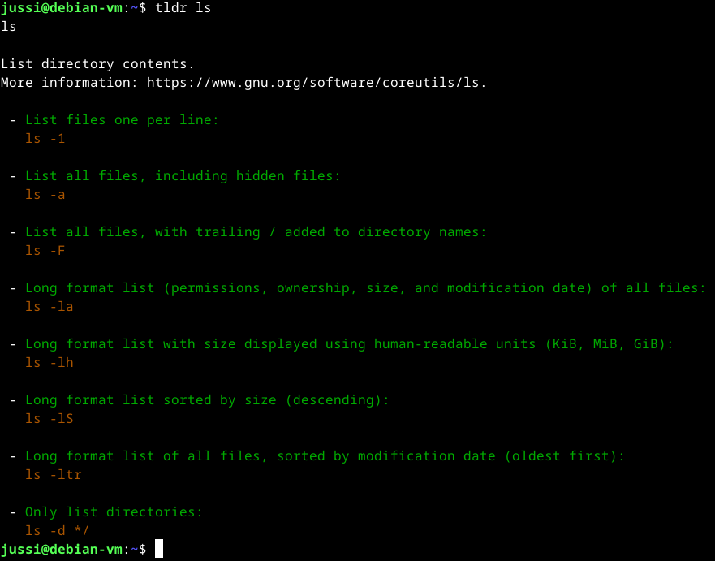
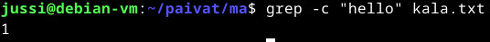
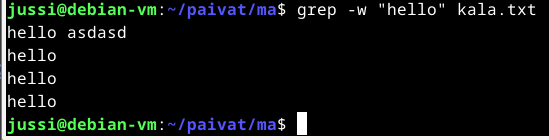

# Tärkeimmät komennot
$ pwd - print working directory. Missä hakemistossa ollaan/työskennellään tällä hetkellä.  
$ ls - list files. Listaa hakemiston tiedostot. 
$ cd (hakemisto) - change directory. Vaihda hakemistoa. 
$ cd .. - change directory up. Vaihda hakemistoa yhden ylös. 
$ mkdir (hakemiston nimi) - Make directory. Luo uuden hakemiston.  
$ mv (nimi) (kohde) - Move. Siirrä (tiedosto)(minne) 
$ cat (tiedosto) . Tulostaa komentokehotteeseen tiedoston sisällön. 
*** Poistokomennot tekee sitten työtä käskettyä ja ne eivät varmistuksia kysele. Tarkkana niiden käytössä. ***  
$ rm (tiedosto) . Remove. Poistaa tiedoston   
$ rmdir (hakemisto) . Remove directory. Poistaa hakemiston 
$ man (komennon nimi) . Manual. Näyttää komennon ohjesivun. 
 
Lähde (Tero Karvinen, Command Line Basics Revisited)  
## Ennen kuin tehdään mitään muuta
Päivitetään pakettienhallinta niin saadaan varmasti uusimmat versiot. 
Kuvassa ei näy, mutta terminaali kysyy myös salasanan pääkäyttäjän oikeuksille. 
 

## Micro tekstieditori
Ajetaan komento $ sudo apt install micro.  
Huom. Asensin jo oppitunnilla micron niin terminaalin tuloste saattaa näyttää sinulla erilaiselta.  
Myös ennen ohjelman asennusta terminaali kysyy. Do you want to continue [y/n] kirjoita Y ja enter.  
 

 
Kuvasta näkee ettei tässä tapauksessa tapahtunut mitään, ei asennusta, ei päivitystä. 
Homma valmis. 
## Järjestelmätiedot
Aluksi piti asentaa lshw (list hardware) työkalu. $ sudo apt install lshw.  
Komennolla $ sudo lshw - short -sanitize saadaan näkyville seuraavat tiedot. 
 

 
Listasta ensimmäisenä etsin punaisella viivalla merkityt.  
Keskusmuisti 4 gigatavua. Aivan kuten asennuksessa määriteltiin. 
Prosessori on sama kuin host koneessa.  
Kovalevytila. Se on jostain syystä 21 gigatavua. Ei mitään hajua miksi. Asennuksessa määriteltiin 20GB. 
Ilmeisesti 20GB + käyttöjärjestelmän viemä tila?  
Display SVGA? Jotain Virtualboxin taikoja. Ymmärtäisin jos olisi HDMI.  
Mikäli perehtyisi Virtualboxin sielunelämään enemmän voisi ymmärtää mitä kaikkea se emuloi ja miten. 
Hiiri, näppäimistö ja kuulokkeet toimivat ok. Ne näyttävät listastakin löytyvän.  
## Kolme ohjelmaa
Eka ohjelma - speedtest teminaaliin.  
curl komennolla suoritetaan bash skripti joka hakee nettisivulta speedtestin paketin paketinhallintajärjestelmään.  
$ curl -s https://packagecloud.io/install/repositories/ookla/speedtest-cli/script.deb.sh | sudo bash  
$ sudo apt-get install speedtest  
Ohjelma asennettu tuttuun tapaan  
 

 
Valokuitu käy ja kukkuu. ( ͡° ͜ʖ ͡°) 
Toinen ohjelma - tldr. Manuaalia selkeyttävä ohjelma. 
$ sudo apt install tldr  
Ohjelma toimii esim. tldr ls  
Tekstit on värikoodattu. Vihreä selite ja itse komento on oranssilla. 
 

 
Kolmantena halusin kokeilla jotain muuta kuin terminaalissa toimivaa ohjelmaa. Latasin siis Wireshark Network Analyzer. 
Tällä voidaan analysoida verkkoliikennettä. 
$ sudo apt install wireshark  
Asentaessa kysyy voiko muutkin kuin pääkäyttäjät tallentaa verkkoliikennettä. Ei kyllä anneta siihen oikeuksia.  
 

 
Nopealla vilkaisulla näytti blue screeniltä, mutta eipä kaatunutkaan. 
 

 
Testasin Googlaamatta komentoa millä lähtisi ohjelma päälle ja näköjään wireshark riitti siihen. 
 

## Tärkeimmät hakemistot
/ juurihakemisto. Kaiken yläpuolella. 
/home. Sisältää kaikki kotihakemistot käyttäjille. 
/home/(nimi). käyttäjän kotihakemisto. Tänne käyttäjä voi pelkästään tallentaa tietoja. 
/media. Siirrettävän median kansio. 
/etc. Sisältää järjestelmän asetuksiin liittyviä tekstitiedostoja.  
(Tero Karvinen, Command Line Basics Revisited)

## Grep
1. grep -c "merkkijono" (tiedosto) grep -c "hello" kala.txt  
Komento laskee merkkijonojen määrän tiedostossa kala.txt  
 

 
2. grep -w "merkkijono" (tiedosto) grep -w "hello" kala.txt 
Komento hakee tiedostosta tarkkaa merkkijonoa "hello" tiedostosta kala.txt ja printtaa rivit. 
 

 

