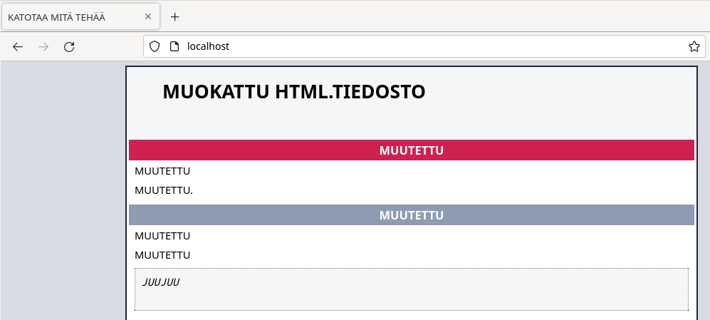

e# Hello Web 
## x) Install Apache Web Server on Ubuntu
Komento asennukselle $ sudo apt-get install apache2. Löytyy suoraan paketinhallinnasta. 
Voit kokeilla onko sivu päällä automaattisesti verkkoselaimella. Osoite http://localhost  
Voit muokata kotisivuja lisäämällä public_html kotihakemistoosi.  
Oikeudet kotisivujen luomiseen pitää antaa komennolla. $ sudo a2enmod userdir  
Tämä komento muokkaa Apachen konfiguraatiotiedostoja. 
Muutosten voimaantulo vaatii Apachen uudelleenkäynnistyksen. Komento $ sudo systemctl restart apache2.  
#### Kotisivujen testaus
$ cd komennolla kotihakemistoon.  
$ mkdir public_html tehdään kansio mihin laitetaan nettisivun vaatimat tiedostot.  
$ whoami komennolla voit selvittää käyttäjänimesi.  
http://localhost/~(nimi)/  
Jos näät kotisivun olet asentanut onnistuneesti palvelimen kotisivuille.  
 
(Karvinen, Install Apache Web Server on Ubuntu) 
## a) Apachen asennus
Apache löytyy suoraan paketinhallintajärjestelmästä eli suoritetaan komento. 
$ sudo apt-get install apache2  
Paketinhallinta tekee työnsä. Nyt voidaan kokeilla onko palvelin päällä.  
Palvelimen tilan voi tarkastaa joko terminaalilla tai verkkoselaimella.
http://localhost url-palkkiin  
Terminaalilla $ sudo systemctl status apache2  
 
  

Palvelin on päällä.  
Jos palvelin ei olisi päällä. Selain sanoisi Unable to connect.  
Ja terminaalissa $ sudo systemctl status apache2 näyttäisi seuraavaa.  

 
### b) Lokitiedot
 
Analysoidaan alin rivi eli uusin kotisivua koskeva pyyntö. 
127.0.0.1 - IP-osoite on koneen mistä pyyntö hakea nettisivu on tullut. Kyseessä on isäntäkone, eli sama kone millä palvelin pyörii. 
 
Tarkistin koneen ip-osoitteen komennolla $ ip addr ja se täsmää 127.0.0.1 kanssa.  
 
"- -" kohdassa olisi käyttäjätunnus ja/tai käyttäjäryhmä. Tiedon puuttuessa se on korvattu viivalla. Luultavasti LAN-verkossa nimet olisi näkyvillä?  
 
Päivämäärä, aika ja aikavyöhyke.  
 
GET = HTTP-metodi verkkosivujen hakemiseen. 
 
HTTP/1.1 on pyynnössä käytetty protokollan versio. 
 
Seuraava tieto on arvokas. Luku 200 on vastauskoodi. Se tarkoittaa, että pyyntö onnistui ja palvelin lähetti pyydetyt tiedot takaisin. 
 
3380 = Palautettujen tavujen määrä kyselyn tekijälle. 
 
Rivistä loput kertoo kyselyn tekijän verkkoselaimen ja käyttöjärjestelmän tietoja/versioita. 
 
Kuvassa voidaan myös huomata esim toiseksi ylimmällä rivillä epäonnistunut yritys pyytää verkkosivu. 
 
Vastauskoodi 404. Epäonnistunut yritys ja palautettujen tavujen määrä paljon pienempi. 
 
(Apache Software Foundation, Log Files)
 

## c) Default sivun vaihtaminen
Tähän toimenpiteeseen löytyy ohje suoraan Apachen esimerkkisivulta. 
 
Mennään terminaalissa $ cd /var/www/html  
$ micro index.html
Korvaan sisältöä omalla ja tallennetaan sudo oikeuksilla.  
Sivu näyttää nyt tältä.  
 
 

## d) Käyttäjien kotisivut
Komennolla $ sudo a2enmod userdir. Muokataan Apachen konfiguraatiota ja annetaan käyttäjille oikeudet luoda kotisivuja. 
Tehdään kotihakemistoon /home/jussi kansio public_html komennolla $ mkdir public_html  
Tein html tiedoston microlla ja sisältö näyttää seuraavalta.  
 
  
Katsotaan miltä se näyttää selaimessa.  
 
  
Eipä toiminut.   
Pitää ajaa komento joka muuttaa tiedostojen ja hakemistojen käyttöoikeuksia. 
$ sudo chmod ugo+x $HOME $HOME/public_html/  
Käytännössä tämä komento antaa käyttäjille, ryhmille ja muille suoritusoikeuden kotihakemistoosi /home/jussi ja sen alahakemistoon public_html. 
 
 
 
Näyttäisi toimivan.  
## f) Curl komennot
Pelkkä curl komento hakee annetun url-osoitteeseen liittyvän sivun sisällön ja tulostaa sen komentoriville. 
 
 
 
curl -I komento tekee sivustolle head pyynnön joka tulostaa otsikkotiedot, mutta ei itse sivun sisältöä.   
 
 
 
Mitä komento sitten kertoo meille?.  
 
HTTP/1.1 200 OK. Protokolla, vastauskoodi 200 OK. Pyyntö on siis onnistunut ja palvelin vastaa meille.  
 
Päivämäärä ok. Kellonaika näyttää GMT eikä UTC+3.  
 
Palvelin Apache/versio 2.4.57 ja toimii (Debian) käyttöjärjestelmällä.  
 
Viimeksi muokattu. Tämä kohta kertoo milloin pyydettyä tiedostoa on muokattu palvelimella edellisen kerran.  
Tästä voi päätellä paljonko aikaa on käytetty suurin piirtein tehtävien tekemiseen. Reilut pari tuntia.  
 
Etag on sivuston yksilöllinen tunniste. 
 
Accept-ranges. Palvelin hyväksyy pyyntöjä tavuina.  
 
Sisällön pituus. 149 tavua  
 
Vary: Accept-Encoding. Liittyy sisällön palvelimen puolella tapahtuvaan kompressointiin ja purkamiseen.  
 
Sisällön tyyppi. tekstiä sisältävä html sivu.  
 
Tarkistin vielä minkälainen jälki jää access logiin head kyselystä.  
 
### 127.0.0.1 - - [06/Sep/2023:19:26:34 +0300] "HEAD /~jussi/ HTTP/1.1" 200 251 "-" "curl/7.88.1"  
 
GET vaihtui HEAD kun ei haettukkaan itse sivustoa vaan pelkkää headeria. Firefoxista ei puhettakaan vaan tilalle tullut curl. 
(Mozilla, HTTP Headers)
### Lähteet
Tero Karvinen 
https://terokarvinen.com/2008/05/02/install-apache-web-server-on-ubuntu-4/ 
https://terokarvinen.com/2012/short-html5-page/ 
Apache Software Foundation 
https://httpd.apache.org/docs/2.4/logs.html 
Mozilla 
https://developer.mozilla.org/en-US/docs/Web/HTTP/Headers 
