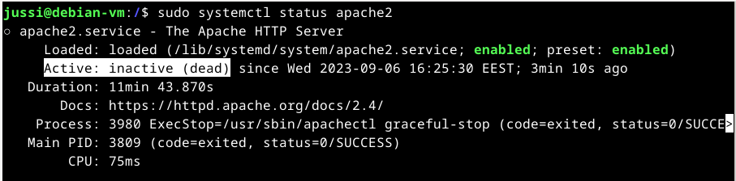

# Hello Web 
## x) Install Apache Web Server on Ubuntu
Komento asennukselle $ sudo apt-get install apache2. Löytyy suoraan paketinhallinnasta. 
Voit kokeilla onko sivu päällä automaattisesti verkkoselaimella. Osoite http://localhost  
Voit muokata kotisivuja lisäämällä public_html kotihakemistoosi.  
Oikeudet kotisivujen luomiseen pitää antaa komennolla. $ sudo a2enmod userdir  
Tämä komento muokkaa Apachen konfiguraatiotiedostoja. 
Muutosten voimaantulo vaatii Apachen uudelleenkäynnistyksen. Komento $ sudo systemctl restart apache2.  
#### Kotisivujen testaus
$ cd komennolla kotihakemistoon.  
$ mkdir public_html tehdään kansio mihin laitetaan nettisivun vaatimat tiedostot.  
$ whoami komennolla voit selvittää käyttäjänimesi.  
http://localhost/~(nimi)/  
Jos näät kotisivun olet asentanut onnistuneesti palvelimen kotisivuille.  
 
(Karvinen, Install Apache Web Server on Ubuntu) 
## a) Apachen asennus
Apache löytyy suoraan paketinhallintajärjestelmästä eli suoritetaan komento. 
$ sudo apt-get install apache2  
Paketinhallinta tekee työnsä. Nyt voidaan kokeilla onko palvelin päällä.  
Palvelimen tilan voi tarkastaa joko terminaalilla tai verkkoselaimella.
http://localhost url-palkkiin  
Terminaalilla $ sudo systemctl status apache2  
 
  

Palvelin on päällä.  
Jos palvelin ei olisi päällä. Selain sanoisi Unable to connect.  
Ja terminaalissa $ sudo systemctl status apache2 näyttäisi seuraavaa.  

 
### b) Lokitiedot
 
Analysoidaan alin rivi eli uusin kotisivua koskeva pyyntö.
127.0.0.1 - IP-osoite on koneen mistä pyyntö hakea nettisivu on tullut. Kyseessä on isäntäkone, eli sama kone millä palvelin pyörii. 
Tarkistin koneen ip-osoitteen komennolla $ ip addr  
"- -" kohdassa olisi käyttäjätunnus ja/tai käyttäjäryhmä. Tiedon puuttuessa se on korvattu viivalla.  
Päivämäärä, aika ja aikavyöhyke.  
GET = HTTP-metodi verkkosivujen hakemiseen. 
HTTP/1.1 on pyynnössä käytetty protokollan versio. 
Seuraava tieto on arvokas. Luku 200 on vastauskoodi. Se tarkoittaa, että pyyntö onnistui ja palvelin lähetti pyydetyt tiedot takaisin. 
3380 = Palautettujen tavujen määrä kyselyn tekijälle. 
Rivistä loput kertoo kyselyn tekijän verkkoselaimen ja käyttöjärjestelmän tietoja/versioita. 
Kuvassa voidaan myös huomata esim toiseksi ylimmällä rivillä epäonnistunut yritys pyytää verkkosivu. 
Vastauskoodi 404. Epäonnistunut yritys ja palautettujen tavujen määrä paljon pienempi. 
 
(Apache Software Foundation, Log Files)
 

## c) Default sivun vaihtaminen
Tähän toimenpiteeseen löytyy ohje suoraan Apachen esimerkkisivulta. 
 
Mennään terminaalissa $ cd /var/www/html  
$ micro index.html
Korvataan sisältö omalla ja tallennetaan.  
Sivu näyttää nyt tältä.  
 
 

https://httpd.apache.org/docs/2.4/logs.html
