# Tiivistelmä ensiaskelista virtuaalipalvelimella
Virtuaalipalvelimelle pääset secure shell yhteydellä komennolla. $ sudo ssh root@(IPv4-osoite)  
Vahva salasana on pakko, ei suositus  
Palomuuriin tehdään aukko portti 22 ja tcp liikenteelle ja otetaan se käyttöön.  
Komennoilla 
$ sudo ufw allow 22/tcp  
$ sudo ufw enable  
Luodaan uusi käyttäjä $ sudo adduser (nimi) 
Siirretään käyttäjä sudo ryhmään $ sudo adduser (nimi) sudo 
Testaa että sudo oikeudet toimivat. 
Lukitaan root käyttäjä. $ sudo usermod --lock root  
Päivitä paketinhallinta 
Asenna esim. apache2 ja tee sinne tarvittavat toimenpiteet (pistä nettisivusi toimimaan) 
Avaa palomuuriin portti 80/tcp. 
(Karvinen, First Steps on a New Virtual Private Server)
## a) Oma virtuaalipalvelin
Otan palvelun linodesta.  
Distribution - Debian 12 
Region - Frankfurt,DE (eu-central) 
Shared CPU - Nanode 1GB 
Root Password - tähän kohtaan vahva salasana 
Kaikki loput palvelut voidaan jättää ottamatta sillä ne ei tuota tässä tapauksessa yhtään lisäarvoa.  
Create Linode  
Menee hetken aikaa kun palvelu pistää koneen pyörimään ja kokeillaan ottaa ssh yhteys omalta virtuaalikoneelta. $ ssh root@139.144.73.75  
 
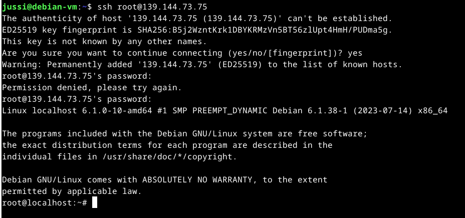  
 
Liian hyvä salasana kun ei ekalla muistanut oikein. Sisällä ollaan. Etäyhteys toimii  
## b) Alkutoimenpiteet
Päivitetään paketinhallinta, palomuurille porttien avaukset, uusi käyttäjä ja käyttäjälle sudo oikeudet. 
Palomuurille toimenpiteet  
Koneella ei ollut asennettuna palomuuria joten $ sudo apt-get install ufw  
Millä selvitin asian? $ man ufw ja vastaus oli "No manual entry for ufw". Asentamisen jälkeen aukesi manuaalisivut :)  
Katsotaan minkälaisessa tilassa palomuuri on asennuksen jälkeen.  
$ sudo systemctl status ufw  
 
 
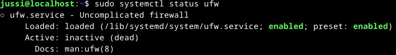
 
 
Uncomplicated state luultavasti tarkoittaa että ei ole tehty ylimääräisiä määrityksiä ja inactive ettei se oli päällä. 
Tehdääs palomuuriin aukot. 
$ sudo ufw allow 22/tcp  
Terminaali sanoo "rules updated" ja "rules updated (v6)" Säännöt päivitetty IPv4 ja v6 osotteille. 
$ sudo ufw enable  
 
En tee vielä aukkoa portti 80/tcp ennen kun olen asentanut ohjelman ja tehnyt Apachella pyörivän sivun joka näytetään ulkomaailmaan.  
Lisätään käyttäjä. ($ sudo adduser jussi) ja terminaali kysyy tiedot ja kirjoittaa ne levylle.  
 
 
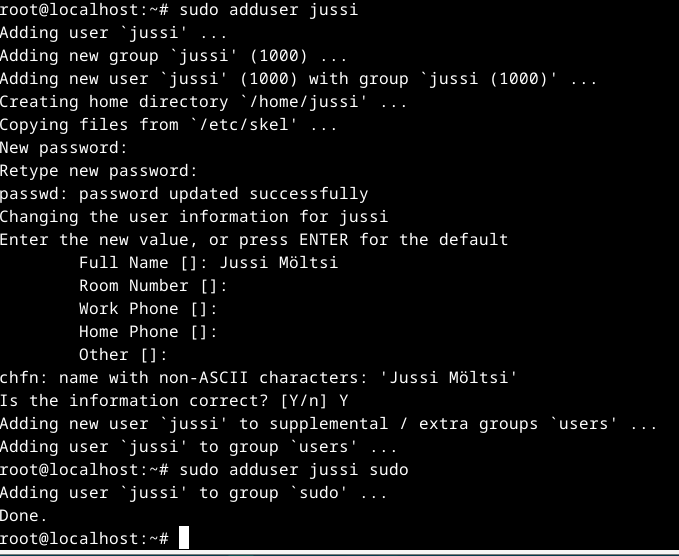
 
 
Kokeillaan toisella terminaalilla että käyttäjä on luotu ja että pääsen sillä sisään koneelle.  
 
 
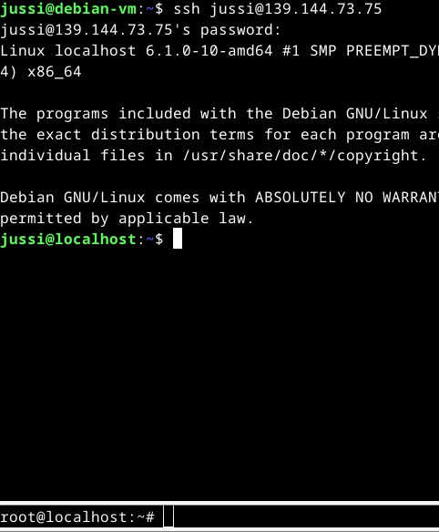
 
 
Kokeilen sudo echo "Hello" että sudo oikeudet ovat voimassa.  
 
 
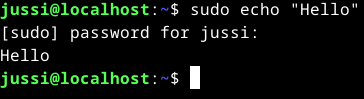
 
 
Oikeudet voimassa jatketaan eteen päin.  
Jatkan työskentelyä omalla käyttäjällä eli kirjaudun root käyttäjältä pois komennolla $ exit
 
 
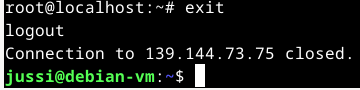
 
 
Seuraavaksi lukitsen root käyttäjän ja kokeilen pääseekö sille kirjautumaan.  
$ sudo usermod --lock root lukitsee root käyttäjän. Testataan pääseekö sille kirjautumaan.  
 
 
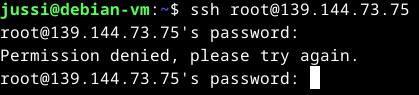
 
 
Ennen kirjautumista mietin antaako terminaali ilmoitusta että onko käyttäjä lukossa. Antoi vasta oikean salasanan jälkeen.   
### c) Palvelin ja sivun vaihto
Apachen ja micro tekstieditorin lataus.  
$ sudo apt-get install apache2 
$ sudo apt-get install micro  
Kun molemmat ohjelmat on asentuneet. -> $ cd var/www/html  
$ ls ja katsotaan että index.html on kansiossa. Onhan se.  
$ micro index.html ja editorilla muokataan sisältö. 
Katsotaan miltä se näyttää terminaalissa.  
 
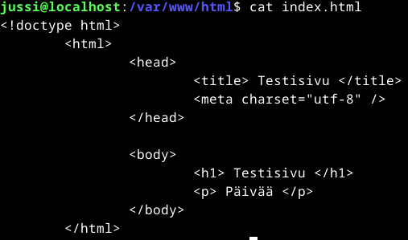  
 
Sitten avataan portti 80/tcp 
$sudo ufw allow 80/tcp ja rules updated ilmoitukset tulevat. 
Katsotaas sitten onko nettisivu internetissä  
 
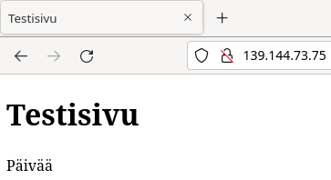
 
Nettisivut näkyvät internettiin. Kaverin vierailu löytyi logeista. Sen tunnistin Windows 11 käyttiksestä ja Opera selaimesta. 
## d) Murtautumisyrityksiä
Pistin virtuaalipalvelimen päälle 15.9 kello 15 aikoihin ja teen tämän kohdan 16.9 samoihin aikoihin. 
Kokeillaan journalctl -n 2000 ja tarkastellaan muutamat rivit päälle.  
Murtautumisyrityksiä on todella paljon. Sen näkee logeista heti.  
Esimerkkinä vaikkapa seuraava.  
 
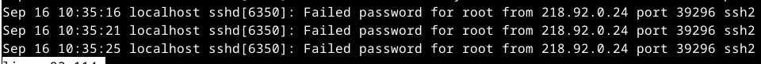
 
Väärällä salasanalla yritetty kirjautua käyttäjälle root käyttäen ssh2 yhteyttä portin 39296 kautta.  
Katsotaas mitä Google sanoo tuosta IPv4 osoitteesta. 
 
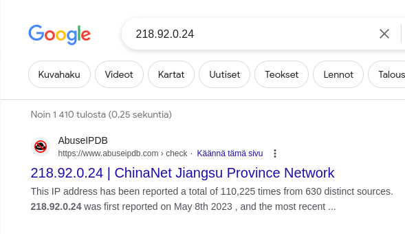
 
Yllättyneet nostaa käden.  
## Lähteet
Tero Karvinen  
https://terokarvinen.com/2017/first-steps-on-a-new-virtual-private-server-an-example-on-digitalocean/
