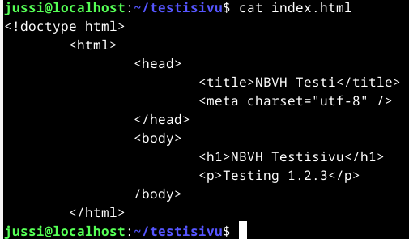

# x) Tiivistelmä
### Uusi vakiosivu Apachelle
- Apachen asennusohjeet.
- Apachen default sivu on käytännössä virtual host.
- Saatavilla olevat sivut mutta ei välttämättä aktiiviset virtual hostit löytyvät /etc/apache2/sites-available/ hakemistosta. Tekstitiedoston sisältä.
- Uuden virtualhostin voi tehdä tekemällä uuden konfiguraatiotiedoston yllä mainittuun hakemistoon.
- Tiedostoon pitää laittaa käytetty portti, documentroot (tiedoston sijainti) ja oikeudet hakemiston käyttöön.
- $ sudo a2ensite (nimi).conf otetaan virtual host käyttöön ja komennolla $ sudo a2dissite 000-default.conf default sivu pois käytöstä.
- Näiden jälkeen uudelleen käynnistys apachelle.
- Uusi index.html sivu täytyy olla samassa sijainnissa minkä kirjoitit host tiedostoon. 
(Karvinen, New Default Website with Apache2 – Show your homepage at top of example.com, no tilde) 
### Virtuaalinen nimipalvelu (Karvinen)
- Palvelinympäristön asennus
- Uusi sivusto nimipalvelulla tehdään uusi konfiguraatiotiedosto /etc/apache2/sites-available/ hakemistoon.
- $ sudo a2ensite (tiedosto) ja uudelleenkäynnistys apache2.
- Luo kotihakemistoosi index.html tiedosto ja sille sisältö.
- Hosts tiedostolla voidaan manipuloida paikallisesti sivustojen nimiä.
- Normaalisti vuokraamme nimen nimipalvelusta. 
(Karvinen, Name Based Virtual Hosts on Apache – Multiple Websites to Single IP Address) 
### Virtuaalinen nimipalvelu (Apache)
- Asiakas ilmoittaa palvelimelle mitä sivua haetaan ja palvelin osaa palauttaa header tietojen perusteella oikean sivuston.
- Pyynnön saapuessa palvelin hakee parhaan/tarkimman parin virtualhost listasta ja palauttaa sen asiakkaalle.
- Jokainen sivu täytyy olla erillisessä <virtualhost> osiossa ja sen täytyy sisältää hakemistopolku html tiedostoon. 
(Apache, Name-based Virtual Host Support) 
### a) Nimen vuokraus
Vuokraan nimen Namecheap.com sivustolta. Auto-renew pois päältä, tätä sivua ei tulla käyttämään pitkään.  
 
  
 
Luodaan A recordeilla yhteys oman virtuaalipalvelimen ip-osoitteeseen. TTL 5 minuuttia. Sivuston nimi jää asiakaskoneen muistiin 5 minuutiksi. 
 
  
 
Testataan näkyykö sivu www.testisivu.wiki osoitteella. Aikaa A recordien määrittämisen ja testin välillä noin 3 minuuttia. 
 
  
 
Kotisivu toimii nimellä haettaessa. 
### b) host ja dig
$ man host 
host - DNS lookup utility  
$ host www.testisivu.wiki ja $ host 139.144.73.75  
 
  
 
Host komento kertoo mikä on domainin IPv4-osoite ja alempi komento kertoo mikä on palvelimen palveluntarjoaja.   
$ man dig  
dig - DNS lookup utility  
 
  
 
Tulosteen alussa voidaan olettaa www.testisivu.wiki pyörivän debian käyttöjärjestelmällä.
Oletan että tässä tulosteessa QUESTION SECTION ja ANSWER SECTION ovat ne tärkeimmät tiedot. 
Kysely lähetetään DNS-palvelimelle.  
Vastaus osiosta voidaan tulkita domainin osoittavan 139.144.73.75 IPv4-osoitteeseen. 
300 on luultavasti Time to live aika sekuntteina = 5 minuuttia. 
Query time: 11 millisekuntia kyselyn vastauksessa kesti tuon ajan. 
Server taitaa viitata DNS-palvelimeen mihin kysely kohdennettiin.  
Päivämäärä UTC ajassa.  
MS SIZE rcvd:63 ilmeisesti DNS-vastauksen koko?  
 
### c) Etusivu uusiksi
Halutaan kotisivu olevan käyttäjän kotihakemistossa ja muokattavissa vapaasti.  
Tarvitsee siis tehdä Karvisen Name Based Virtual Hosts ohjeiden mukainen konfiguraatio tiedosto ja ottaa se käyttöön.
Aloitetan tehtävän koti hakemistosta ja aluksi luon testisivu kansion ja sinne index.html tiedoston ja siihen sisällön. 
Käytän Karvisen simppeliä html pohjaa sivulle. 
 
  
 
Seuraavaksi mennään /etc/apache2/sites-available ja luodaan sinne justestisivu.com.conf konfiguraatiotiedosto. 
Ajetaan $ sudo a2ensite justestisivu.com ja apachelle reload komennot  
 
  
 
Katsotaan näkyykö selaimessa mitään.  
 
  
 
Vielä ei näy mitään. Luetaas ohjeita ja katsotaan saadaanko korjattua. 
Tämä osio julistetaan nyt parin tunnin väännön jälkeen tappioksi.  
#### Toimenpiteet
1.Testisivu hakemisto ja sinne index.html tiedosto  
2./etc/apache2/sites-available sinne justestisivu.com.conf kuvan sisällöllä. 
3.$ sudo a2ensite justestisivu.com 
4.$ sudo systemctl reload apache2 
5. Selaimella testaus sivulle. ei näy. 
6.$ sudo a2enmod userdir 
7.apache reload 
8. Selaimella testi, ei näy 
Liittyykö ongelma käyttöoikeuksiin?  
Muutama tunti taukoa ja kokeillaan vielä viimeiset ideat läpi.  
Harjoitus kolmosessa käytettiin komentoa $ sudo chmod ugo+x $HOME $HOME/public_html/ muokkaamaan
### Lähteet
Tero Karvinen  
New Default Website with Apache2 – Show your homepage at top of example.com, no tilde 
https://terokarvinen.com/2016/02/16/new-default-website-with-apache2-show-your-homepage-at-top-of-example-com-no-tilde/  
Name Based Virtual Hosts on Apache – Multiple Websites to Single IP Address 
https://terokarvinen.com/2018/04/10/name-based-virtual-hosts-on-apache-multiple-websites-to-single-ip-address/ 
Short HTML5 page 
https://terokarvinen.com/2012/short-html5-page/ 
Apache Foundation 
Name-based Virtual Host Support 
https://httpd.apache.org/docs/2.4/vhosts/name-based.html 
