# x) Tiivistelmät
### Python Web Idea
Opit tekniikoita, joka
- Palvelee asiakkaita kaikilla alustoilla
- Kerää tietoa miten palvelua käytetään. (lokit)
- Antaa monien käyttäjien muokata tietoa yhtä aikaa
- Toimii asentamatta mitään
- Käyttää uusinta ohjelmaversiota 
(Karvinen, Python Web - Idea to Production - 2023) 
### Django tietokanta tutoriaali
Edellytyksinä, linux asennettuna ja Linux komentokehotteen käyttö. 
Kehitysympäristön asennus ohjeet ja virtualenv (kehitysympäristö) ensiaskeleet. 
Kun työskennellään virtualenvissä, komentokehotteessa kuuluu lukea (env) komentorivin alussa. 
Pakettien asennuksessa pitää käyttää harkintaa ja suorittaa niitä vain (env) tilassa. Älä käytä sudoa. 
Kehityspalvelinta ei parane näyttää internettiin. 
Ohjeet adminin ja käyttäjien luontiin. 
Tietokannan luomisen ohjeet ja käyttäjien lisääminen tietokantaan. 
(Karvinen, Django 4 Instant Customer Database Tutorial)
### Django tuotantoasennus
Esivaatimukset, Linux komentokehotteen käyttö, virtuaalipalvelin ja testiympäristö (virtuaalikone). 
Projektia varten tarvitset Apache2 web-palvelimen, virtuaalihostin ja web-sivun jossa on sisältöä. 
Django projektin joka tehdään virtualenv ympäristöä käyttäen. 
Djangon ja Apachen yhdistämisessä tarvitaan 3 hakemistopolkua. Django projektin mistä löytyy manage.py tiedosto, Polku wsgi.py tiedostoon ja Virtualenv site-packages hakemisto. 
Copy-pastea tiedostopolkuja ja vältä kirjoitusvirheet = debug tarve vähenee. 
/etc/apache2/sites-available/ konfiguraatiotiedosto vaatii nyt enemmän kuin pelkän virtualhostin 
Debug moodi kannattaa poistaa käytöstä, ettei paljasta ylimääräistä tietoa hakkereille tms. 
## a) Djangon asennus
Aloitetaan seuraamalla<a href="https://terokarvinen.com/2022/django-instant-crm-tutorial/"> Karvisen ohjeita</a> Djangon asennukseen ja siitä tietokannan rakentamiseen.  
Teen tehtävän omalla paikallisella virtuaalikoneelle. 
$ sudo apt-get update ja upgrade perään. Paketinhallinta päivitetty.  
$ sudo apt-get -y install virtualenv - asennetaan virtualenv ympäristö. -y on automaattinen "yes" vastaus yes/no kyselyihin. 
$ virtualenv --system-site-packages -p python3 env/ Tällä komennolla luodaan virtuaaliympäristö joka pääsee käsiksi järjestelmän paketteihin ja luo env/ hakemiston. 
Katsotaan tekikö komento hakemiston. 
 
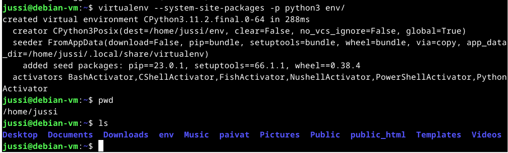  
 
hakemisto löytyy otetaan nopea vilkaisu sisältöön.  
 
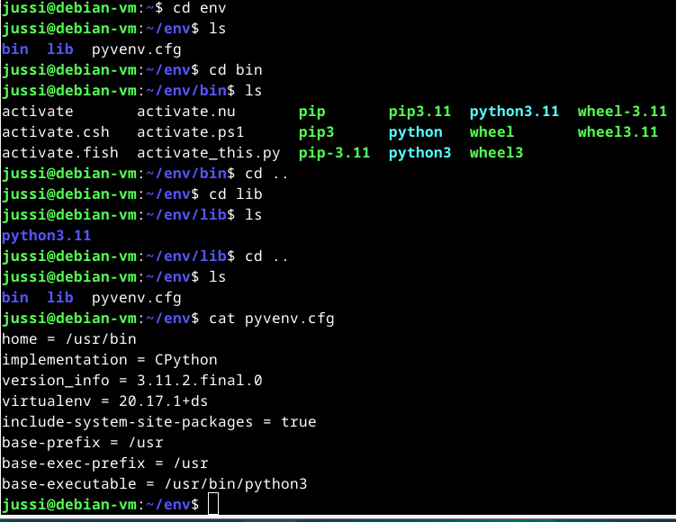  
 
Ei mennä liian syvälle, löytyy sym-link tiedostoja (cyan) ja suoritettavia tiedostoja (vihreä).  
$ source bin/activate riittää koska olen jo /env hakemistossa. Aloitetaan käyttämään env ympäristöä. 
/home/jussi/env/bin/pip 
Luodaan /home/jussi/env hakemistoon requirements.txt sisältö "django"  
$ pip install -r requirements.txt - Asennetaan pythonin paketinhallinnalla tiedoston sisällä määritellyt paketit. 
 
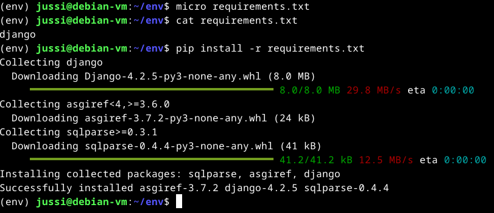  
 
Lopputulos django 4.2.5 versio 
 
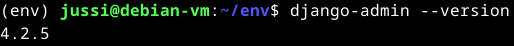  
 
Django framework on nyt onnistuneesti asennettu. 
### b) Projekti tietokannalla
Aloitetaan django projekti. 
$ django-admin startproject testikanta  
Tarkistetaan mihin hakemisto luotiin  
 
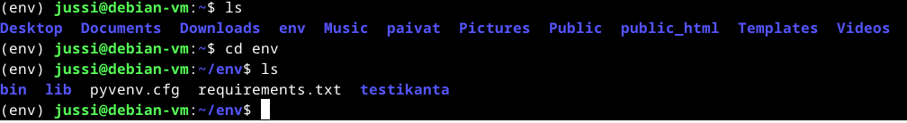  
 
Helpottaa tilannekuvan hahmottamista suorittaa näitä tarkistuksia. 
Kokeillaas sitten toimiiko kehityspalvelin 
$ cd testikanta 
$ ./manage.py runserver 
 
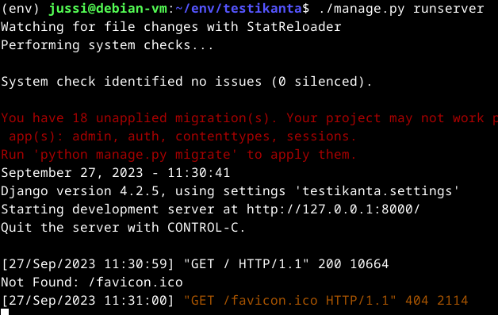  
 
Starting development server at http://127.0.0.1:8000/ -> Firefox ja url http://127.0.0.1:8000/ 
 
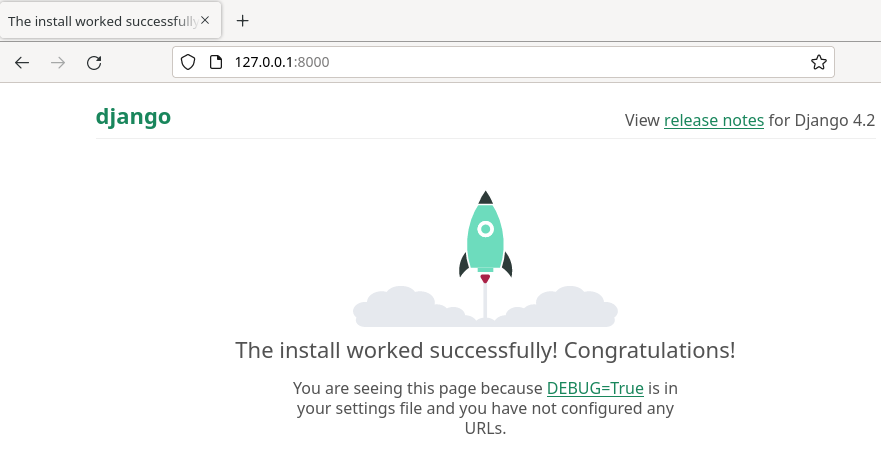  
 
Palvelin toimii onnistuneesti.  
### Admin interface
Kirjautumissivut ovat olemassa mutta ei käytössä 
Päivitetään tietokanta. 
$ ./manage.py makemigrations 
$ ./manage.py migrate 
Tuloste on seuraava  
 
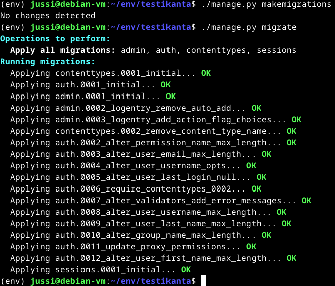  
 
Ensimmäinen komento ei tehnyt mitään muutoksia mutta migrate komento ilmeisesti otti käyttöön joitain tietokantarakenteita. 
Lisätään käyttäjä.  
$ ./manage.py createsuperuser 
 
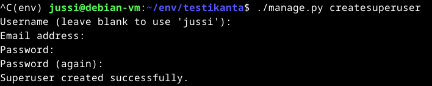  
 
Kysyy tiedot, syötetään ne. Palvelin päälle $ ./manage.py runserver  
URL - http://127.0.0.1:8000/admin/ 
 
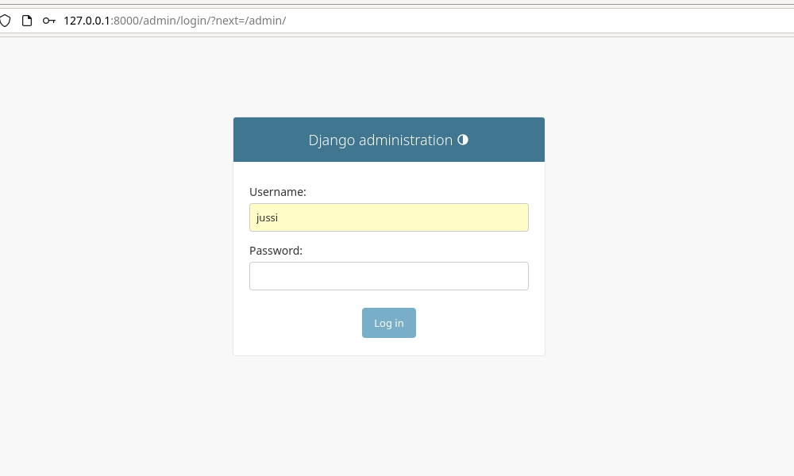  
 
Kirjaudun laittamillani tiedoilla. 
 
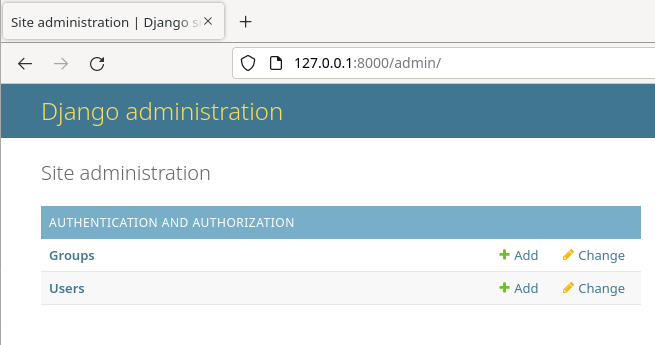  
 
Sisällä ollaan, kirjautuminen toimii. 
Tehdään uusi käyttäjä Users kohdasta vihreästä plus merkistä 
Annetaan käyttäjänimeksi esmes ja hyvä salasana  
esmessille staff ja superuser ryhmät että voi muokata tietoa.  
Permissions kohdasta laitetaan staff ja superuser laatikoihin täpät ja sivun alaosasta save  
Kokeillaan kirjautua 
 
  
 
esmes on sisällä, käyttäjän lisäys onnistui.  
### CRM tietokanta
Uusi hakemisto crm sovellukselle 
$ ./manage.py startapp crm 
 
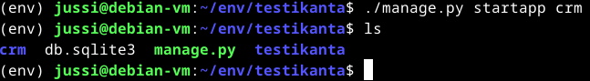  
 
Lisätään crm testikanta/settings.py tiedostoon INSTALLED_APPS osioon. 
$ micro testikanta/settings.py 
 
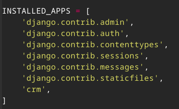  
 
Sitten muokataan crm hakemiston sisältöjä.  
$ micro crm/models.py 
 
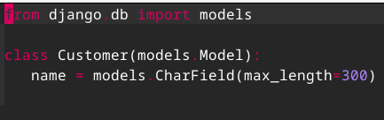  
 
Tällä saadaan luotua "customer" taulu tietokantaan "name" sarakkeella 
Tuodaan uudet tietokannan rakenteet.  
$ ./manage.py makemigrations 
$ ./manage.py migrate 
 
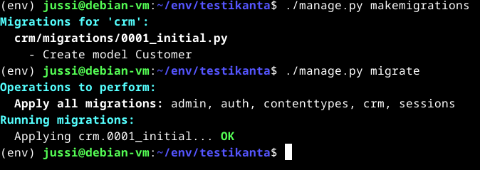  
 
Tällä kertaa makemigrations haki tietokantarakenteen. Joka olettaen tekee tietokantaan tuon customer taulun  
Ja migrate komento otti sen käyttöön.  
Jotta muutokset nähtäisiin ne täytyy rekisteröidä  
$ micro crm/admin.py 
 
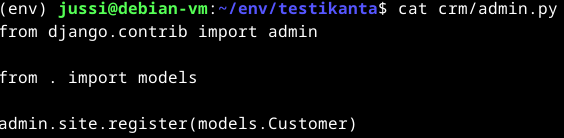  
 
Palvelin päälle ja katsotaan mitä on tehty.  
$ ./manage.py runserver 
 
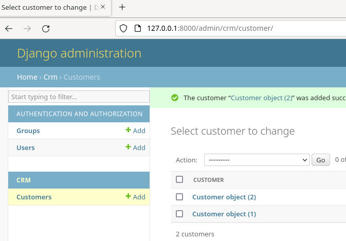  
 
CRM ja pari asiakasta lisätty onnistuneesti.  
Asiakkaille nimet lisäämällä models.py tiedostoon metodi joka palauttaa customer olion nimen. 
 
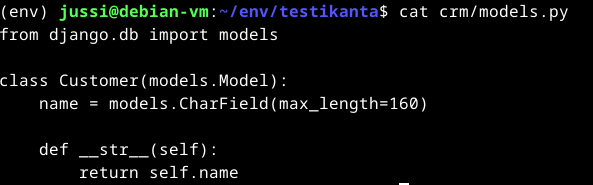  
 
Palvelin päälle ja katsotaan muuttuiko nimet.  
 
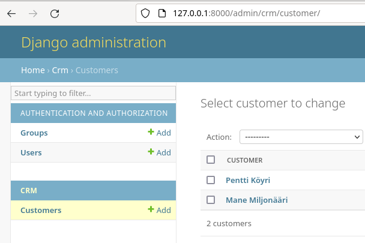  
 
Asiakkaiden nimet näkyy normaalisti, tehtävä suoritettu  
### c)Tuotantotyyppinen asennus
Seurataan <a href="https://terokarvinen.com/2022/deploy-django/"> Karvisen ohjeita</a> djangon tuotantoasennukseen 
Listataan alkunu mitä kaikkea omalla virtuaalikoneella on jo valmiina 
- Apache2 
- micro 
- /var/www/html/index.html apachen vakiosivu vaihdettuna 
- /home/jussi/public_html löytyy index.html 
- Djangolla tehty projekti 

Aloitetaan siis luomalla virtualhost. 
$ sudoedit /etc/apache2/sites-available/testikanta.conf  
(EDIT. Pidemmälle mennessä huomasin että tämän sisältö on väärin mutta se korvattiin) 
 
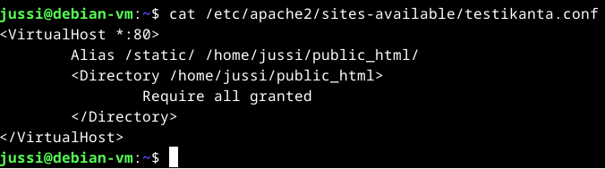  
 
Otetaan sivusto käyttöön ja poistetaan default käytöstä, Apachen uudelleenkäynnistys sekä testataan curl localhost miltä näyttää.  
 
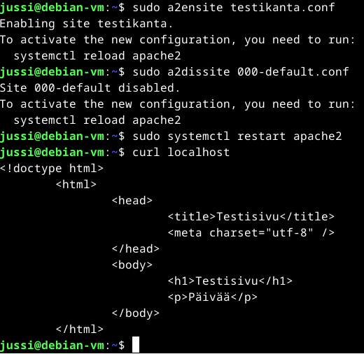  
 
Siirrytään ohjeessa osioon Connect Python to Apache using mod_wsgi  
Muokataan konfiguraatiotiedostoa. 
$ sudoedit /etc/apache2/sites-available/testikanta.conf 
 
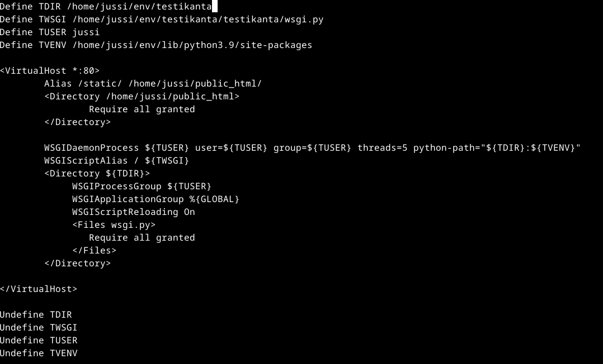  
 
Mikäli tulkitsin oikein niin sen pitäisi olla oikein. (EI OLLUT) 
TDIR - polku mistä löytyy manage.py ok 
TWSGI - polku mistä löytyy wsgi.py ok 
 
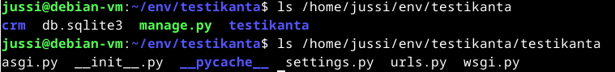  
 
Asennetaan Apachen WSGI moduuli  
$ sudo apt-get -y install libapache2-mod-wsgi-py3  
Testataan syntaksi komennolla  
$ /sbin/apache2ctl configtest 
 
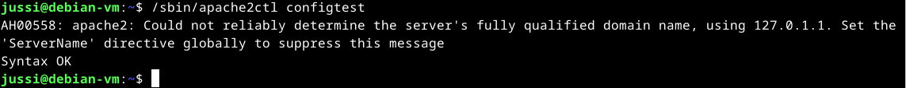  
 
Syntaksi on ok 
Valittaa ettei ole varsinaista domainia niin käytetään localhostia ilmeisesti. 
$ curl -s localhost|grep title  
 
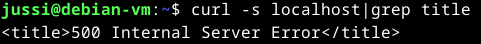  
 
Jokin on pielessä.  
Tarkistetaas testikanta.conf tiedoston sisältö. Sieltähän löytyy pieniä virheitä. 
Alias /static/ ${TDIR}/public_html/ on väärä. /static/ kuuluu vaihtaa /public_html/  
Katselin tarkistuksena läpi nuo hakemistopolut ja TVENV on väärä nykyinen versio on python3.11 joten 3.9 pitää vaihtaa  
 
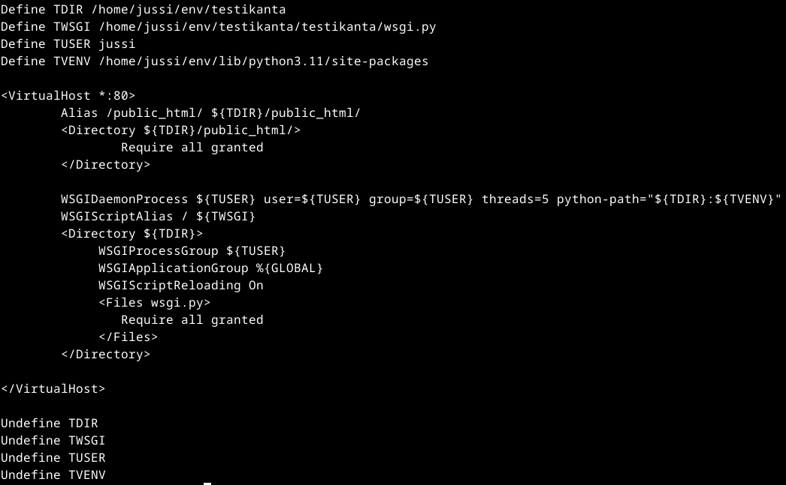  
 
Apachelle uudelleenkäynnistys 
Katsotaas mitä verkkosivu sanoo  
Kokeillaan komennot  
$ curl -s localhost|grep title  
$ curl -sI localhost|grep Server  
 
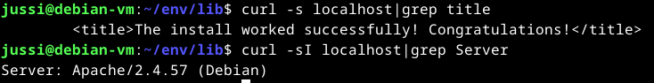  
 
Apachehan se siellä.  
Selaimella testi.  
 
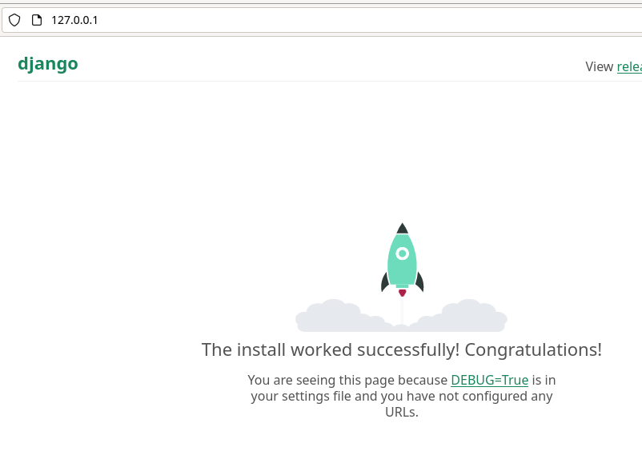  
 
TOIMII!  
### Debug pois
Virheilmoitukset on kultakaivos hakkereille otetaan ne pois päältä.  
$ cd env/testikanta
$ micro testikanta/settings.py
Muutetaan seuraavat kohdat.  
DEBUG = False  
ALLOWED_HOSTS = ["localhost"] (ei sähköpostia koska nyt ollaan ihan paikallisesti eikä ole domainia)
 
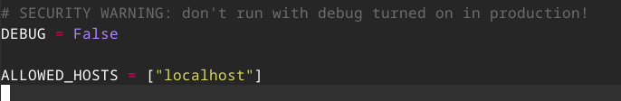  
 
Jopa kommentti sanoo ettei tuotannossa pidä olla debug päällä.  
$ touch testikanta/wsgi.py päivittää tiedoston.  
Apache uudelleenkäynnistys.  
$ curl -s localhost|grep title  
<title>Not Found</title>  
Homma menee juuri kuin ohjeessa.  
$ cd env/testikanta/
$ micro testikanta/settings.py
Lisätään tiedostoon STATIC_ROOT tieto  

### Lähteet
Tero Karvinen  
Python Web - Idea to Production - 2023 
https://terokarvinen.com/2023/python-web-idea-to-production/#osaamistavoitteet 
Django 4 Instant Customer Database Tutorial 
https://terokarvinen.com/2022/django-instant-crm-tutorial/ 
Deploy Django 4 - Production Install 
https://terokarvinen.com/2022/deploy-django/ 
