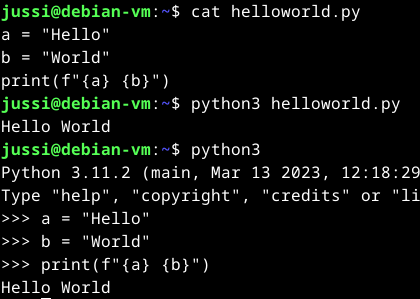
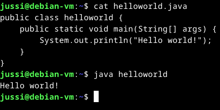
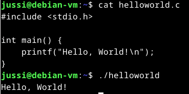
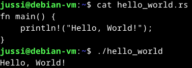
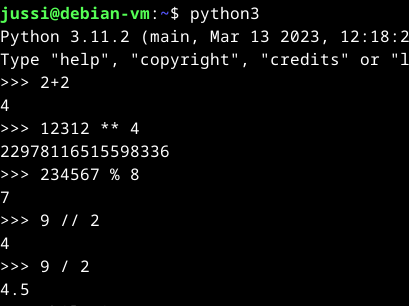
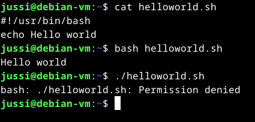
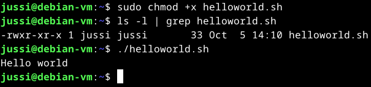

## x) Linkit
H0 https://github.com/JussiMol/Linux-palvelimet/blob/a11ecad2897b3cf47c072e2f74b66e6e4de91e6f/h0.md  
H1 https://github.com/JussiMol/Linux-palvelimet/blob/8c93c8786d0d7789193efcf162f43529db86f58b/h1.md  
H2 https://github.com/JussiMol/Linux-palvelimet/blob/8c93c8786d0d7789193efcf162f43529db86f58b/h2/Komentaja%20Pingviini.md  
H3 https://github.com/JussiMol/Linux-palvelimet/blob/8c93c8786d0d7789193efcf162f43529db86f58b/h3/HelloWeb.md  
H4 https://github.com/JussiMol/Linux-palvelimet/blob/8c93c8786d0d7789193efcf162f43529db86f58b/h4/MaailmaKuulee.md  
H5 https://github.com/JussiMol/Linux-palvelimet/blob/8c93c8786d0d7789193efcf162f43529db86f58b/h5/Nimitt%C3%A4in.md  
H6 https://github.com/JussiMol/Linux-palvelimet/blob/8c93c8786d0d7789193efcf162f43529db86f58b/h6/Django.md  
## y) Tiivistelmä
Itselle <a href="https://terokarvinen.com/2018/hello-python3-bash-c-c-go-lua-ruby-java-programming-languages-on-ubuntu-18-04/"> artikkelin</a> kielistä ainoa kunnolla tuttu on python. 
Hello world monella eri kielellä. 
## a) Hei maailmat
Tehdään yksinkertaiset hello world ohjelmat Tero Karvisen<a href="https://terokarvinen.com/2018/hello-python3-bash-c-c-go-lua-ruby-java-programming-languages-on-ubuntu-18-04/"> artikkelin</a> ohjeita seuraten Javalla ja C:llä. Pythonilla voi vähän kikkailla kun se on itselle entuudestaan tuttu kieli. 
#### Python
Python oli ladattuna virtuaalikoneelle jo jollain aiemmalla oppitunnilla. 
Käytin tulostuksessa f-merkkijonoa. Se tulostaa lainausmerkkien sisällön ja {} sulkeissa voidaan käyttää muuttujia ja ohjelma tulostaa seuraavasti.  
 

#### Java
Javan kanssa seurasin suoraan ohjeita, muutin vaan koodia vähän.  
 

#### C
C:n kanssa myös ohjeiden mukaan.  
 

#### Ekstra kieli Rust
Asennan paketinhallinnasta Rust kielen. Ensin piti etsiä mitä asennetaan.  
$ sudo apt search rust  
Hetken selailin listaa ja päätin että ladataan koko ohjelmointikieli.  
$ sudo apt-get install rust-all  
 

 
Microlla tein hello_world.rs tiedoston ja käännettiin rustrc (tiedostonimi) komennolla   
#### Python laskimena
Laskuoperaattorit  
** = potenssi 
% = jakojäännös 
// = jakolasku (kokonaisluku) 
/ = jakolasku (liukuluku) 
 

 
#### Shell skripti ja uusi komento
Teen microlla tiedoston helloworld.sh ja sisältö selviää kuvasta.  
 

 
Komennosta haluttiin kaikille suoritettava, täytyy muokata käyttöoikeuksia  
 

 
Chmodilla annetaan eXecute/suoritus oikeudet tiedostoon kaikille käyttäjille.  
Testin perusteella se toimii halutusti.  
